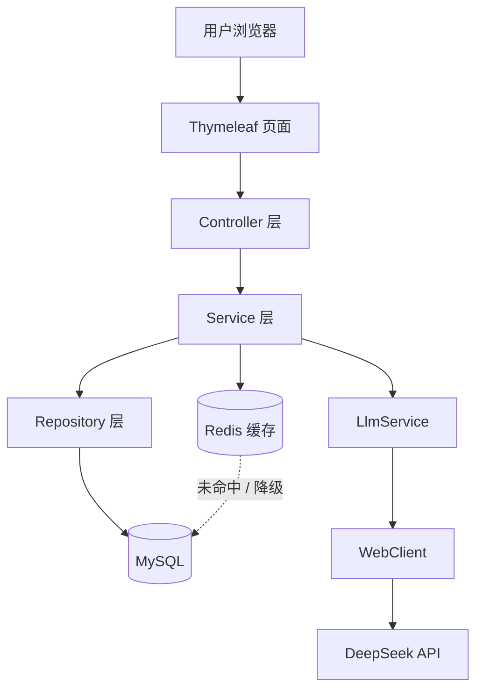
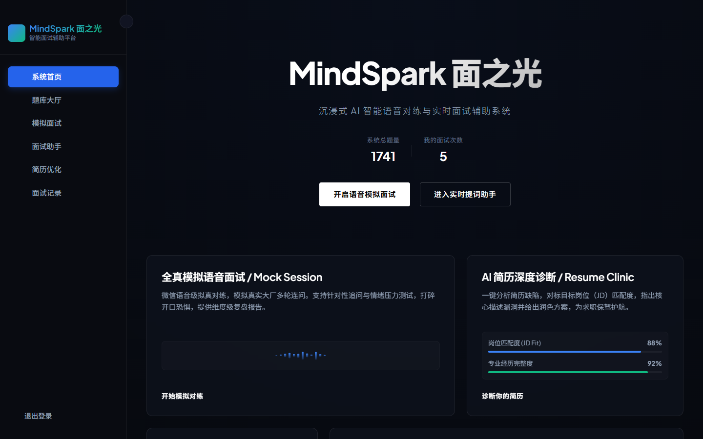
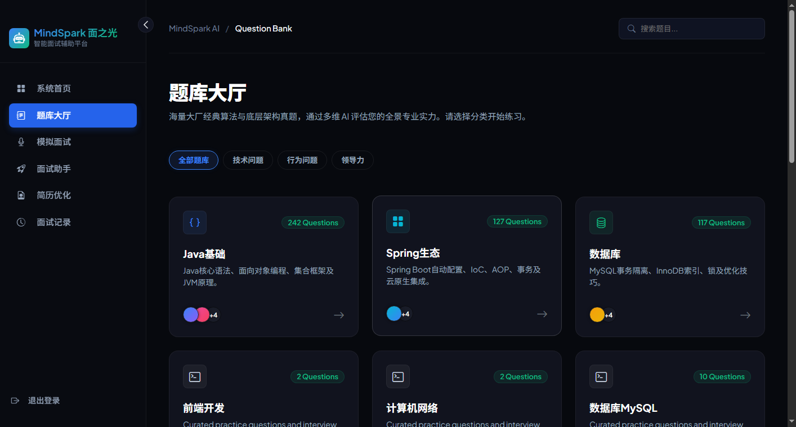
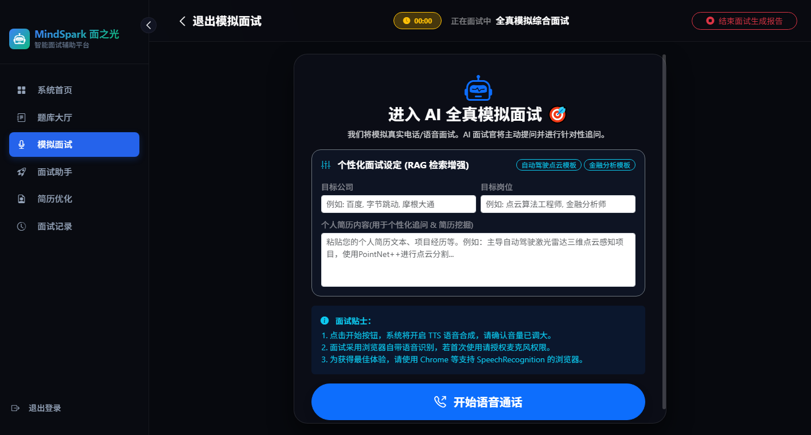

# AI 面试助手（Interview-Assistant）

<p align="center">
  
  
  
  
  
</p>

基于大语言模型的智能模拟面试与评测平台。后端采用 **Java 21 + Spring Boot 3** 分层架构，前端使用 **Thymeleaf** 服务端渲染，通过自研 **LlmService** 接入 **DeepSeek API**（WebClient 异步调用），实现流式面试、代码评测、简历分析与报告生成。系统包含 **管理员 / 普通用户** 双角色：管理员维护题库，用户刷题与 AI 面试。

---

## 技术栈

| 层次 | 技术 |
|------|------|
| 语言 / 框架 | Java 21 · Spring Boot 3 · Spring Security · Spring Data JPA |
| 数据库 | MySQL 8.0 |
| 缓存 | Redis 7（热点题库缓存，30 分钟 TTL，Redis 不可用时降级查 MySQL） |
| 前端 | Thymeleaf · HTML / CSS / JavaScript |
| AI 接入 | WebClient · DeepSeek API · SSE 流式响应 |
| 接口文档 | SpringDoc OpenAPI（Swagger UI） |
| 部署 | Docker · Docker Compose |

---

## 系统架构



**请求链路：** 用户 → Thymeleaf 页面 → Controller → Service → Repository → MySQL  
**AI 链路：** Service → LlmService → WebClient → DeepSeek API

---

## 核心功能

- **题库浏览与刷题**：按技术栈标签、难度、题型筛选，支持 LeetCode 风格代码作答
- **AI 模拟面试**：SSE 流式对话，多面试官人设，连续技术追问
- **全真模拟面试**：无固定题库，结合简历与目标岗位自由对话
- **面试助手 Copilot**：实时提词 + 截图 OCR，辅助真实面试场景
- **简历诊断与优化**：PDF / Word 解析，AI 打分与 ATS 优化
- **多维评估报告**：结构化 JSON 解析，能力维度评分与改进建议
- **管理员后台**：题库 CRUD、分类/关键词检索（`/admin`，ROLE_ADMIN）

**演示账号：** `admin` / `123456`（管理员） · `user` / `123456`（普通用户）

---

## 系统预览

> 以下截图为本地运行 `http://localhost:8081` 的实际界面（MindSpark 面之光 / Interview-Assistant）。  
> 如需重新生成，启动应用后执行：`py scripts/capture_screenshots.py`

### 系统首页



### 题库大厅



### 全真模拟面试



---

## 快速开始（本地开发）

### 1. 环境依赖

- Java 21+
- Maven 3.8+
- MySQL 8.0+
- Redis 7+（可选，未启动时自动降级查 MySQL）

### 2. 配置初始化

**请勿将 API Key 写入 Git。** 按以下步骤配置本地密钥：

```bash
cd src/main/resources
copy application-local.yml.example application-local.yml   # Windows
# cp application-local.yml.example application-local.yml  # macOS / Linux
```

编辑 `application-local.yml`，填入 MySQL 密码、Redis 地址与 DeepSeek API Key：

```yaml
spring:
  datasource:
    password: your_mysql_password
  data:
    redis:
      host: localhost
      port: 6379

interviewai:
  llm:
    enable-real-api: true
    api-key: YOUR_DEEPSEEK_API_KEY_HERE
```

也可通过环境变量注入（优先级更高）：

```bash
set DEEPSEEK_API_KEY=your_key_here    # Windows CMD
$env:DEEPSEEK_API_KEY="your_key_here" # PowerShell
```

### 3. 启动项目

```bash
mvn spring-boot:run
```

浏览器访问：http://localhost:8081

### 4. API 文档（Swagger）

启动后访问：http://localhost:8081/swagger-ui.html

> 若 API Key 曾泄露到 GitHub，请立即在 [DeepSeek 控制台](https://platform.deepseek.com/api_keys) 作废并重新生成。

---

## REST API

对外 REST 接口统一使用 `ApiResponse<T>` 包装响应，无需登录即可访问（`/api/v1/**` 已放行）。

### 查询题库列表

```
GET /api/v1/questions
```

| 参数 | 类型 | 必填 | 说明 |
|------|------|------|------|
| `tag` | string | 否 | 技术栈标签，对应题目 `category`，如 `Java基础` |
| `difficulty` | string | 否 | 难度筛选：`简单` / `中等` / `困难` |

**示例**

```bash
# 全部题目
curl http://localhost:8081/api/v1/questions

# 按标签筛选
curl "http://localhost:8081/api/v1/questions?tag=Java基础"

# 标签 + 难度
curl "http://localhost:8081/api/v1/questions?tag=Java基础&difficulty=简单"
```

**响应示例**

```json
{
  "code": 200,
  "message": "success",
  "data": [
    {
      "id": 1,
      "category": "Java基础",
      "title": "请解释一下 Java 中的多态是什么，并给出一个实际应用场景？",
      "answer": "...",
      "difficulty": "简单",
      "questionType": "conceptual",
      "defaultCode": null
    }
  ]
}
```

数据来自 `QuestionService`，优先读 Redis 缓存（30 分钟 TTL），Redis 不可用时自动降级查 MySQL。

---

## Docker Compose 一键部署

### 1. 准备环境变量

```bash
copy .env.example .env   # Windows
# cp .env.example .env    # macOS / Linux
```

编辑 `.env`，填入 `DEEPSEEK_API_KEY` 和 MySQL 密码。

### 2. 启动全部服务

```bash
docker-compose up -d
```

将自动拉起 **MySQL + Redis + 应用**，应用端口映射为 `8081`。

### 3. 访问

- 应用：http://localhost:8081
- Swagger：http://localhost:8081/swagger-ui.html

### 4. 停止

```bash
docker-compose down
```

---

## Redis 缓存说明

题库列表与分类标签查询走 **Cache-Aside** 模式：

1. 先查 Redis → 命中则直接返回（日志 `[Redis HIT]`）
2. 未命中则查 MySQL → 写入 Redis，TTL 30 分钟（日志 `[Redis MISS]` / `[Redis SET]`）
3. Redis 连接失败时自动降级查 MySQL（日志 `[Redis DOWN]`），不影响正常业务

---

## 项目结构

```
interviewai/
├── src/main/java/com/interviewai/
│   ├── controller/     # 控制器（Thymeleaf 页面 + REST API）
│   ├── service/        # 业务逻辑（含 LlmService、QuestionService）
│   ├── repository/     # JPA 数据访问
│   ├── entity/         # 实体类
│   └── config/         # Security、Redis、OpenAPI 配置
├── src/main/resources/
│   ├── templates/      # Thymeleaf 模板
│   ├── application.yml
│   └── application-local.yml.example
├── docs/screenshots/   # README 功能截图
├── Dockerfile
├── docker-compose.yml
└── .env.example
```

---

## License

MIT
